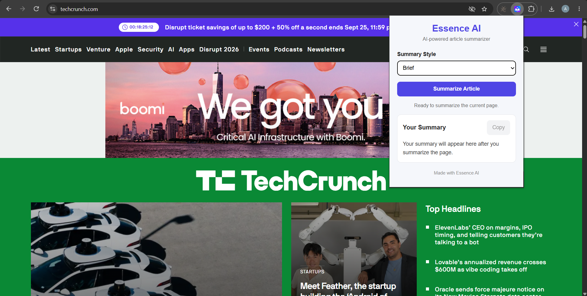
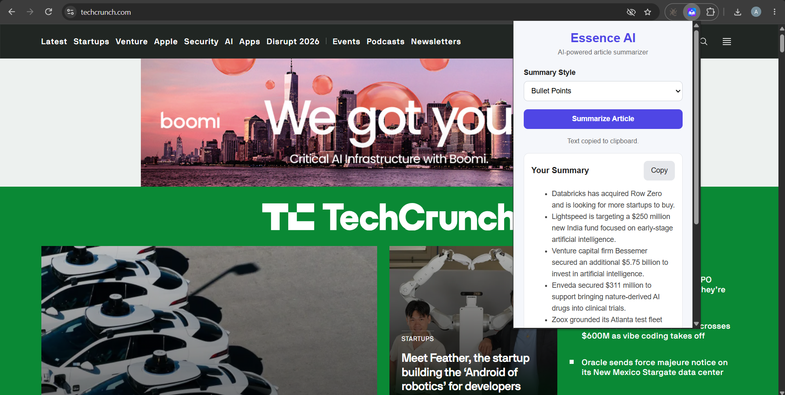

# Essence AI

A Chrome extension that summarizes news articles, blogs, and webpages using Google's Gemini AI.

## ✨ Features

- **Brief Summary:** Get a quick overview of the main ideas.
- **Bullet Points:** View key takeaways in an easy-to-read format.
- **Detailed Summary:** Get a more comprehensive summary of the content.
- **Copy Summary:** Copy the generated summary to your clipboard.
- **Simple Interface:** Summarize webpages directly from your browser.

## 🛠️ Built With

- HTML
- CSS
- JavaScript
- Chrome Extensions API (Manifest V3)
- Node.js
- Express.js
- Google Gemini API

## 🚀 Getting Started

Follow these steps to run Essence AI locally.

### 📋 Prerequisites

- Google Chrome
- Node.js and npm
- A Google Gemini API key

### 📥 Installation

1. **Clone the repository:**

   ```bash
   git clone https://github.com/akshay-appala/essence-ai.git
   ```

2. **Navigate to the project folder:**

   ```bash
   cd essence-ai
   ```

3. **Install backend dependencies:**

   ```bash
   cd backend
   npm install
   ```

4. **🔑 Configure environment variables:**

   Create a `.env` file inside the `backend` folder by copying the provided `.env.example` file.

   Add your Gemini API key and configure the required environment variables, such as the Gemini model and server port, in `.env`.

5. **Start the backend server**

   From the `backend` directory, run:

   ```bash
   node server.js
   ```

   Keep the terminal running while using the extension.

### 🤖 Choosing a Gemini Model

Essence AI allows you to configure the Gemini model through the `GEMINI_MODEL` environment variable.

If you encounter API rate limits or service availability issues, you can try another supported Gemini model.

Update the `GEMINI_MODEL` value in your `backend/.env` file:

```env
GEMINI_MODEL=your_preferred_model
```

Replace `your_preferred_model` with the model ID you want to use.

### 🧩 Load the Extension in Chrome

1. Open `chrome://extensions` in Chrome.
2. Enable **Developer mode**.
3. Click **Load unpacked**.
4. Select the `essence-ai` project folder.
5. Open a webpage and click the Essence AI extension icon to summarize it.

---

**Note:** Use `.env.example` as a template for configuration.

## 📁 Project Structure

```text
essence-ai/
├── backend/
│   ├── .env              # Created locally; not committed
│   ├── .env.example      # Template for environment variables
│   ├── package-lock.json
│   ├── package.json
│   └── server.js
├── icons/
│   ├── 16x16.png
│   ├── 32x32.png
│   ├── 48x48.png
│   └── 128x128.png
├── popup/
│   ├── popup.css
│   ├── popup.html
│   └── popup.js
├── screenshots/
│   ├── essence-ai-popup.png
│   ├── brief-summary.png
│   └── bullet-summary.png
├── .gitignore
├── manifest.json
└── README.md
```

## ⚙️ How It Works

1. Open a webpage you want to summarize.
2. Click the Essence AI extension icon.
3. Choose a summary format: Brief, Bullet Points, or Detailed.
4. Essence AI extracts the webpage content and sends it to the backend.
5. The backend uses the Gemini API to generate a summary.
6. View the summary directly in the extension popup and copy it to your clipboard.

## 📸 Screenshots

### 1. Extension Popup



### 2. Brief Summary


### 3. Bullet Points Summary



## 🛠️ Usage

1. Make sure the backend server is running.
2. Open Chrome and click the **Essence AI** extension icon.
3. Navigate to the webpage you want to summarize.
4. Choose a summary mode:
   - **Brief:** Get a short summary.
   - **Bullet Points:** View the key points.
   - **Detailed:** Get a more comprehensive summary.
5. Click the button to generate the summary.
6. Use **Copy Summary** to copy the generated text to your clipboard.

## 🔧 Troubleshooting

### 🔌 Backend Server Not Running

If Essence AI cannot connect to the backend, make sure the backend server is running.

From the `backend` directory, run:

```bash
node server.js
```

The server should be available at `http://localhost:3000`.

### 🔑 Missing or Invalid Gemini API Key

Make sure your Gemini API key is correctly configured in the `backend/.env` file.

Verify that the environment variable is named `GEMINI_API_KEY`.

### ⚠️ Gemini API Quota or Rate Limits

If you encounter quota or rate-limit errors, check your API usage and limits in Google AI Studio.

You can also try another supported Gemini model by updating the `GEMINI_MODEL` variable in your `.env` file.

### 🌐 Backend Connection Errors

If the extension displays a connection error:

1. Make sure the backend server is running.
2. Verify that the server is listening on port `3000`, or the port configured in your `.env` file.
3. Reload the Essence AI extension from `chrome://extensions`.
4. Try summarizing the webpage again.
